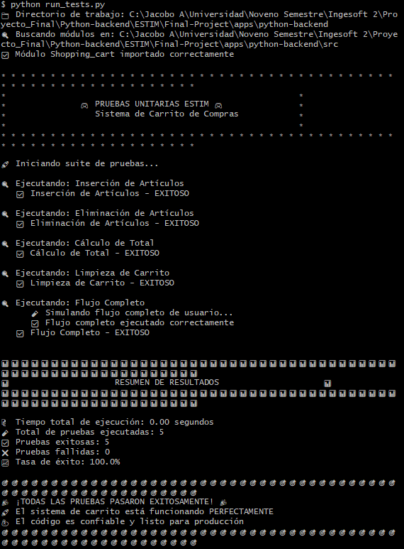

# PYTHON-BACKEND DOCUMENTATION

## 🚀 Implemented Endpoints

### 🔍 Basic Endpoints
| Method | Endpoint | Description |
|--------|----------|-------------|
| `GET` | `/` | Basic health check |
| `GET` | `/health` | Service status |
| `GET` | `/test-db` | Verify database connection |

### 🛒 Shopping Cart
| Method | Endpoint | Description |
|--------|----------|-------------|
| `POST` | `/shopping_cart/items/{game_id}` | Add to cart |
| `DELETE` | `/shopping_cart/items/{game_id}` | Remove item from cart |
| `GET` | `/shopping_cart` | Query cart |
| `GET` | `/shopping_cart/total` | Calculate total |
| `DELETE` | `/shopping_cart/clear` | Clear entire cart |

### 🎮 Games Catalog
| Method | Endpoint | Description |
|--------|----------|-------------|
| `GET` | `/games/` | List of available games |
| `GET` | `/games/search` | Search by name, minimum and maximum price |
| `GET` | `/games/search/genre` | Search by genre |
| `GET` | `/games/popular` | Currently most popular games |
| `GET` | `/games/recent` | Recent searches |

### ⚙️ Administration
| Method | Endpoint | Description |
|--------|----------|-------------|
| `POST` | `/admin/seed-data` | Insert test data |

---

## 🔄 DATA FLOW
Client → FastAPI Endpoint
⬇️
Endpoint → Dependency Injection (DB Session)
⬇️
Business Logic → Cart Operations
⬇️
Data Access → SQLAlchemy Query
⬇️
Response → Pydantic Model → JSON

---

## 📐 APPLIED SOLID PRINCIPLES

### 1. ✅ **Single Responsibility Principle (SRP)**
Each module has a single reason to change:

- **`main.py`**: Exclusively responsible for defining API endpoints and handling HTTP routes
- **`Shopping_cart.py`**: Solely responsible for shopping cart business logic
- **`database.py`**: Exclusively responsible for database connection and model definition
- **`seed_data.py`**: Solely responsible for test data insertion

### 2. ✅ **Open/Closed Principle (OCP)**
Entities should be open for extension but closed for modification:

- The system is designed to extend functionality without modifying existing code
- We can add new cart item types (DLCs, packages, subscriptions) without changing base logic
- We can add new endpoints without affecting existing ones
- The model structure allows adding new fields without breaking existing functionality

### 3. ✅ **Liskov Substitution Principle (LSP)**
Objects should be replaceable with instances of their subtypes without altering behavior:

- Pydantic response models can be used interchangeably where game data is expected
- The cart handles items generically, allowing for future product types
- Injected dependencies (DB sessions) are interchangeable and consistent
- Error responses maintain uniform structure throughout the API

### 4. ✅ **Interface Segregation Principle (ISP)**
Many specific interfaces are better than one general interface:

- **Specific endpoints for specific operations**:
  - `GET /shopping_cart` only for querying
  - `POST /shopping_cart/items` only for adding
  - `DELETE /shopping_cart/items` only for removing

- **Separate dependencies for different concerns**:
  - Database dependency for CRUD operations
  - Cart dependency for business operations
  - Specific response models for different data views

### 5. ✅ **Dependency Inversion Principle (DIP)**
Depend on abstractions, not on concrete implementations:

- Endpoints depend on SQLAlchemy Session abstraction, not specific PostgreSQL implementation
- Business logic depends on cart interfaces, not concrete storage implementations
- FastAPI injects dependencies through abstractions, not direct implementations
- The system could switch from PostgreSQL to MySQL by modifying only the data layer, without affecting business logic

---

## 🏗️ SYSTEM ARCHITECTURE
                PRESENTATION LAYER
                (FastAPI Endpoints)
                        ⬇️
                 SERVICE LAYER
            (Business Logic - Cart)
                        ⬇️
                DATA ACCESS LAYER
              (SQLAlchemy ORM + Models)
                        ⬇️
                  DATA LAYER
               (PostgreSQL Database)

---

## 🧪 UNIT TESTS

Created `run_tests.py` file that runs tests for:
- ✅ Add item
- ✅ Remove item  
- ✅ Total calculation

**With positive results**

